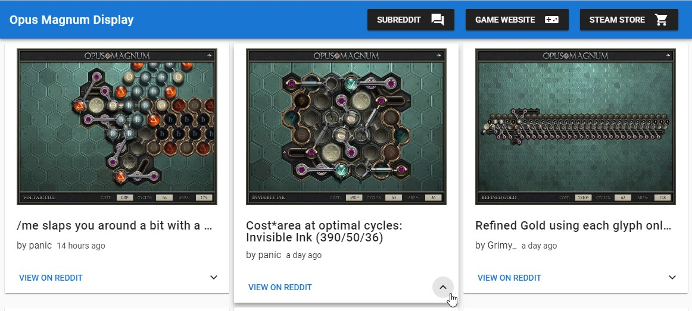
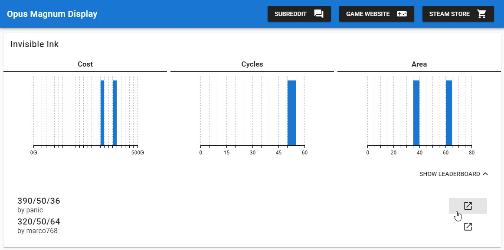

# Opus Magnum Display (Powered by Reddit)

> Solution animation display of the game Opus Magnum and more, powered by the official [Opus Magnum subreddit](https://reddit.com/r/opus_magnum)!

*Static webpage developed with VueJs, Vuetify, D3, and more awesome web development things :)*

# Pages

- Featured: puzzle solutions featured on subreddit (same list as subreddit listing)
    - Card view of each solution: solution animation/video, thread title, author, submission time


- Metrics: aggregated solution metrics from subreddit listings
    - Histogram charts of each puzzle: grouped together solutions submitted by subredditors; and gathered metrics accordingly



# TODO

- App
    - GIF support for imgur, giphy, and other gif images hosts
    - some form of data caching? cache subreddit listing, then prompt to update?
- 'Featured' tab
    - load more thread action (currently set at first 10 solutions/threads)
    - smoother UI indication of cards loading
    - filter by puzzles/categories
- 'Metrics' tab
    - better loading UI (use linear progress bar on top of page; indicate no. of threads loaded)
    - separate leaderboards by metrics when showing metric charts in row

## Build Setup

``` bash
# install dependencies
npm install

# serve with hot reload at localhost:8080
npm run dev

# build for production with minification
npm run build
```

For detailed explanation on how things work, consult the [docs for vue-loader](http://vuejs.github.io/vue-loader).
